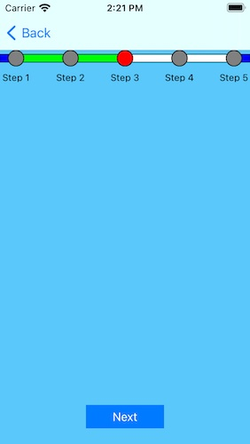
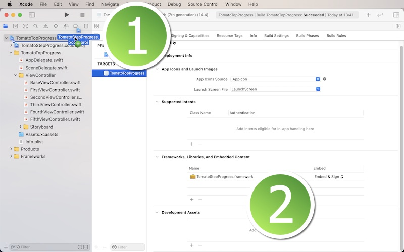
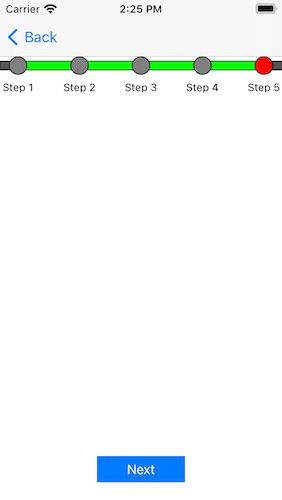

# TomatoStepProgress Framework

<h2>Development and compatibility</h2>

Development platform: iOS 
Language: Swift 
UI framework: UIKit 
Compatibility: iOS 13 or greater 

<h2>Description</h2>

TomatoStepProgress is a customizable Swift framework that shows a series of steps that the user has to complete and their current progress at the top of the view of each view controller.  The following is a list of features.

<ol>
<li>Have options of blinking or not blinking the current step position with two different colors.</li>
<li>Adjust the speed of blinking the current step position.</li>
<li>Adjust the diameter of the position circles and other settings.</li>
</ol>

<h2>Installation</h2>

1. In order to use this framework, download the sample project.  You will find the folder titled **TomatoStepProgressFramework**.  Locate the Xcode file inside.  And put this Xcode file in your Xcode project.  Select your target and make sure you have **TomatoStepProgress.framework** under General > Framworks, Libraries, and Embeded Content as shown below.

2. Create a sub-class of **UIViewController**.  Name it BasicViewController, BaseViewController, RootViewController or whatever you want such that all child view controllers can be based on.  For now, let us call this base view controller **BaseViewController**.  Import **TomatoStepProgress** to the view controller.

3. In the base view controller, set the class to **TomatoStepProgressViewController**.  Create a function to set up the menu.  Let us call this function **setup(index: Int)**.

4. In the setup function, create an array of step progress models with **TomatoProgressModel**.  This struct takes two properties: name (String) and index (Int).  The **name** property is the name of a step that the app user has to go through.  The index property determines the order of appearance of the corresponing step.

5. Call **tomatoProgressSetup(index: index)** in the setup(index: Int) function of the base view controller.

7. In each view controller where you intend to show the step progress, change the class to BaseViewController.  In its **viewDidLoad** method, call setup(index: number), where 'number' is an Int type value of a step progress.

<h2>Variables</h2>

<li>blinkingSpeed: It's speed at which the current position changes its colors.</li>
<li>blinkCurrent: It's a boolean value for blinking or not blinking the current position with two colors.</li>

<li>topEdge: It's the top edge size where the container of the whole thing appears.</li>
<li>sideEdge: It's the left edge size where the first step starts and the right edge size where the last step ends.</li>

<li>circleDiameter: It's the diameter of the step circle.</li>
<li>onFillColor: It's the on-state fill color of the circle of the current step.</li>
<li>offFillColor: It's the off-state fill color of the circle of the current step.</li>
<li>incompleteFillColor: It's the fill color of the circles of other steps.</li>
<li>strokeColor: It's the stroke color of the circle.</li>
<li>strokeWidth: It's the stroke size of the circle.</li>

<li>textPosition: It's the space between the circle and the step name label.</li>
<li>textColor: It's the text color of the step name label.</li>
<li>textSize: It's the text size of the step name label.</li>
<li>labelHeight: It's the height of the step name label.</li>
<li>labelBackColor: It's the background color of the step name label.</li>

<li>pathHeight: The path is the line between two circles.  And this setting refers to the path height.</li>
<li>pathWidth: It's the stroke size of the path.</li>
<li>pathStrokeColor: It's the stroke color of the path.</li>
<li>incompletePathColor: It's the color of the path between the previous and the current step.</li>
<li>completePathColor: It's the color of the path of the incomplete steps.</li>
<li>startPathColor: It's the color of the path between the left edge and the first step.</li>
<li>goalPathColor: It's the color of the path bewteen the last step and the right edge.</li>
<li>containerBackColor: It's the background color of the container of the whole thing.</li>

